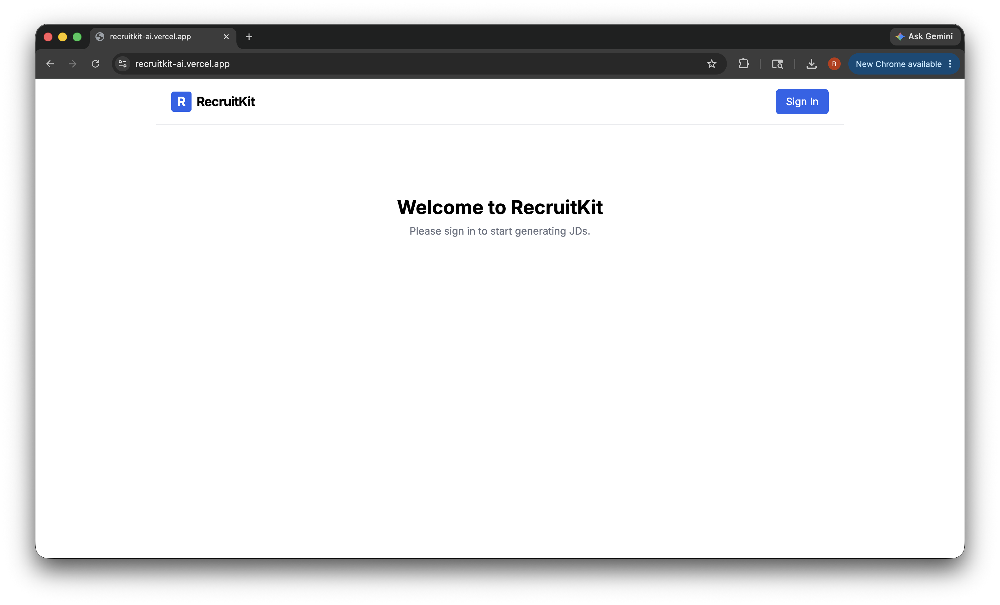
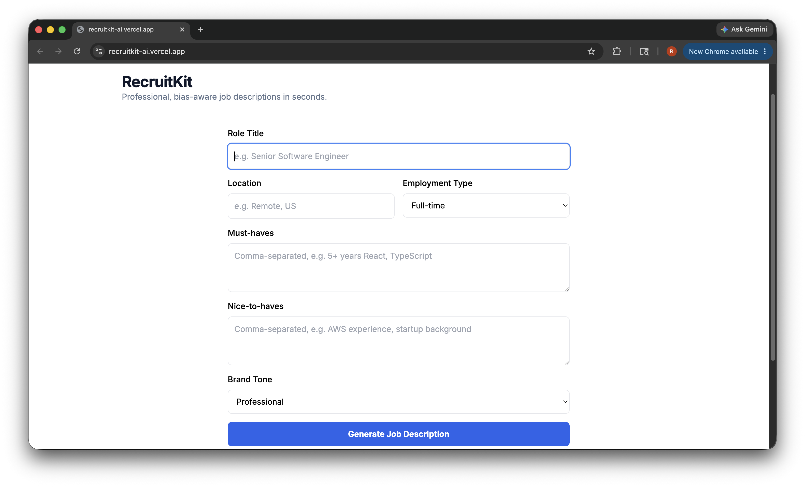
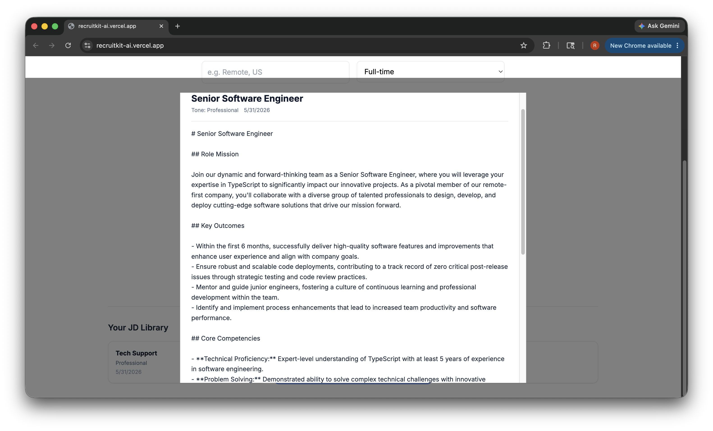
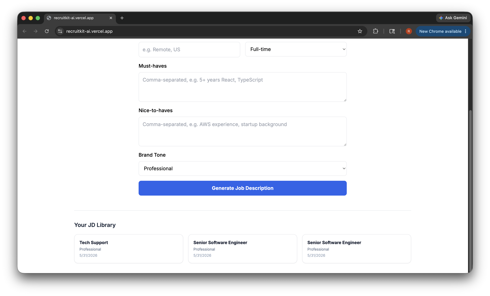

# RecruitKit ⚡

An AI-powered job description generator built for staffing agencies. Input a role and tone, and RecruitKit generates a professional, bias-aware job description in seconds — authenticated, logged, and ready to use.

**🔗 Live Demo:** [recruitkit-ai.vercel.app](https://recruitkit-ai.vercel.app)

---

## Screenshots

### Homepage (signed out)


### Generation form


### Generated job description


### JD library


---

## The Problem It Solves

Recruiters waste time writing and rewriting job descriptions from scratch. Wording inconsistency leads to bias, poor candidate targeting, and slower hiring cycles. RecruitKit automates the first draft — giving agencies a consistent, professional starting point in seconds.

---

## Architecture

RecruitKit is a full-stack SaaS application with authentication, a persistent user database, and an AI generation pipeline.

```
User signs in (Clerk)
        ↓
  [ensureUser] → upserts authenticated user into Postgres (User table)
        ↓
  [GenerateForm] → user inputs role title + tone preference
        ↓
  [/api/generate] → validates input, calls OpenAI with structured prompt
        ↓
  [OpenAI] → returns bias-aware, professional job description
        ↓
  [DB Write] → saves generated JD to Job table (linked to User.id)
        ↓
  [Frontend] → renders result instantly
```

---

## Tech Stack

| Layer | Technology |
|---|---|
| Frontend | Next.js 14 (App Router), TypeScript, Tailwind CSS |
| Authentication | Clerk |
| AI Generation | OpenAI SDK |
| Database | Supabase (PostgreSQL) |
| ORM | Prisma |
| Deployment | Vercel |

---

## Key Engineering Features

### 1. Full-Stack Authentication with Clerk
Every route is protected by Clerk middleware. Unauthenticated users are redirected to sign-in. On first login, a `User` record is automatically upserted into Postgres via `ensureUser`, linking the Clerk identity to the application's database.

### 2. Persistent Job History
Every generated job description is saved to a `Job` table in Supabase, linked to the authenticated user via a foreign key on `User.id`. Users build a library of generated JDs across sessions.

### 3. Structured AI Output
The OpenAI integration uses a carefully engineered prompt to enforce professional tone, inclusive language, and consistent structure — producing job descriptions that are ready to publish, not just raw AI output.

### 4. Serverless-Safe Prisma Client
The Prisma client is cached on `globalThis` to prevent connection pool exhaustion during Vercel serverless warm starts — a common production failure point that most tutorials don't address.

---

## Database Schema

```sql
-- Authenticated users synced from Clerk
CREATE TABLE "User" (
  id                 TEXT PRIMARY KEY,
  clerkId            TEXT UNIQUE NOT NULL,
  email              TEXT UNIQUE NOT NULL,
  subscriptionStatus TEXT DEFAULT 'inactive',
  jdQuota            INTEGER DEFAULT 3,
  createdAt          TIMESTAMPTZ DEFAULT now()
);

-- Generated job descriptions linked to users
CREATE TABLE "Job" (
  id        TEXT PRIMARY KEY,
  userId    TEXT REFERENCES "User"(id),
  title     TEXT NOT NULL,
  content   TEXT NOT NULL,
  tone      TEXT NOT NULL,
  createdAt TIMESTAMPTZ DEFAULT now()
);
```

---

## Running Locally

```bash
git clone https://github.com/RichTravels/recruitkit
cd recruitkit
npm install
```

Create a `.env.local` file:

```env
# App
NEXT_PUBLIC_URL=http://localhost:3000

# Clerk
NEXT_PUBLIC_CLERK_PUBLISHABLE_KEY=
CLERK_SECRET_KEY=
NEXT_PUBLIC_CLERK_SIGN_IN_URL=/
NEXT_PUBLIC_CLERK_SIGN_UP_URL=/
NEXT_PUBLIC_CLERK_AFTER_SIGN_IN_URL=/
NEXT_PUBLIC_CLERK_AFTER_SIGN_UP_URL=/

# OpenAI
OPENAI_API_KEY=

# Database
DATABASE_URL=postgresql://...@pooler.supabase.com:6543/postgres?pgbouncer=true&connection_limit=1
DIRECT_URL=postgresql://...@pooler.supabase.com:5432/postgres
```

```bash
npm run dev
```

Open [http://localhost:3000](http://localhost:3000)

---

## Project Structure

```
recruitkit/
├── src/
│   ├── app/
│   │   ├── api/
│   │   │   └── generate/
│   │   │       └── route.ts        # JD generation endpoint
│   │   ├── sign-in/
│   │   ├── sign-up/
│   │   └── page.tsx                # Authenticated dashboard
│   ├── components/
│   │   ├── GenerateForm.tsx        # JD input form
│   │   └── Header.tsx
│   └── lib/
│       ├── prisma.ts               # Singleton Prisma client
│       └── openai.ts               # OpenAI client
├── prisma/
│   ├── schema.prisma
│   └── migrations/
│       └── 20260529220000_add_recruitkit_user_job/
├── .env.local.example
└── README.md
```

---

## Git Workflow

This project follows a feature-branch workflow simulating professional team development:

| Branch | Purpose |
|---|---|
| `feature/database-setup` | Migrated from SQLite/PlanetScale to Supabase PostgreSQL, secured env files |
| `feature/runtime-fixes` | Fixed Prisma client reuse and Job FK bug causing Vercel 500s |
| `feature/gitignore-cleanup` | Removed `.next` build artifacts from git tracking |

No direct commits to `main`. All changes merged via documented Pull Requests.

---

## Engineering Tradeoffs

### Why Supabase instead of PlanetScale?
The original build used PlanetScale (MySQL). This version migrates to Supabase (PostgreSQL) to consolidate infrastructure — sharing a single Supabase project with SignalStack using isolated table namespacing. This eliminated a paid tier requirement while maintaining full data separation between applications.

### Why shared Supabase project?
Supabase's free tier limits two active projects. Rather than upgrading to a paid plan, RecruitKit's tables (`User`, `Job`) were added alongside SignalStack's tables (`enrichment_jobs`, `pipeline_telemetry`) using idempotent `CREATE TABLE IF NOT EXISTS` SQL — zero risk to existing production data.

### IPv4 + Prisma migration fix
Supabase's direct connection host (`db.*.supabase.co`) is IPv6-only without a paid add-on. Migrations were routed through the Supavisor session pooler (`port 5432`) instead, while runtime queries use the transaction pooler (`port 6543`) — the officially recommended Supabase + Prisma + Vercel configuration.

---

## About

Built as part of a portfolio demonstrating full-stack AI SaaS engineering — authentication flows, persistent user data, AI content generation, and production deployment on Vercel.

**Portfolio:** [your portfolio link]
**LinkedIn:** [your LinkedIn]
**SignalStack:** [signalstack-pearl.vercel.app/telemetry](https://signalstack-pearl.vercel.app/telemetry)
**Support Router:** [support-router.vercel.app](https://support-router.vercel.app)